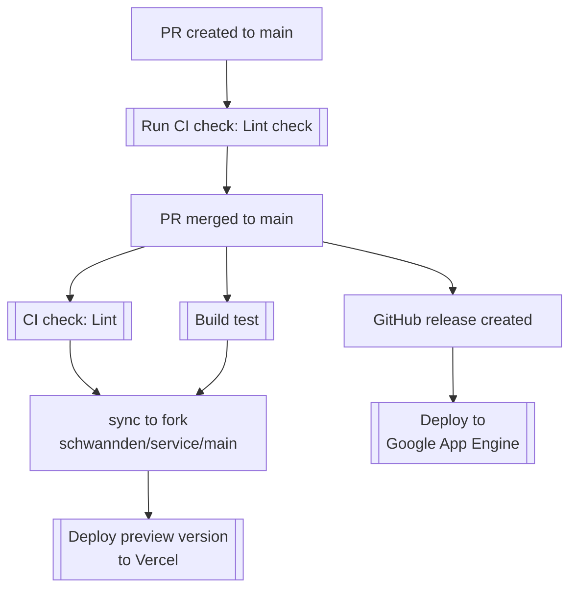
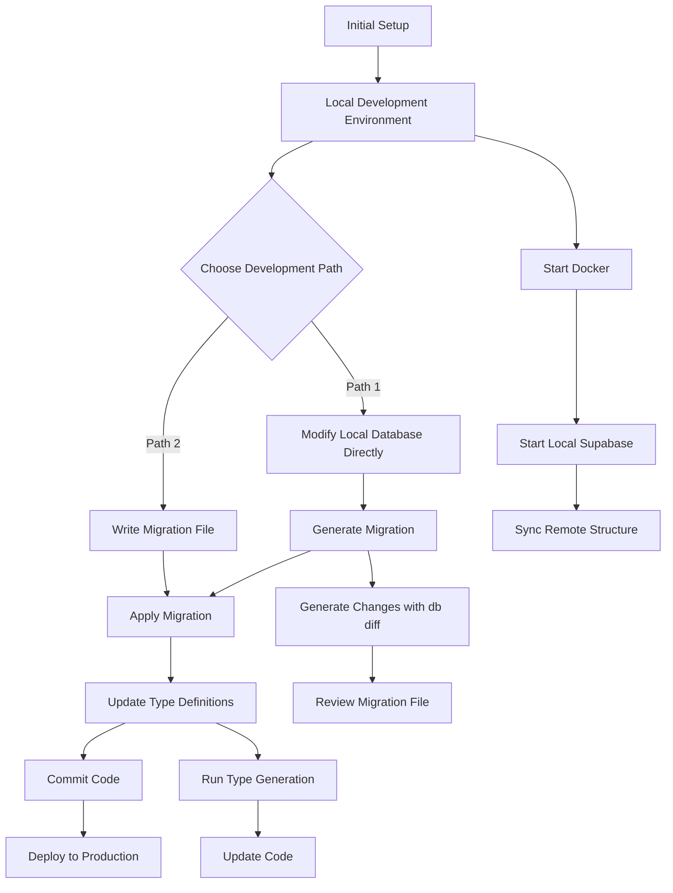
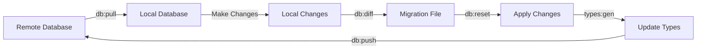

# 萬隆基督的教會服事表

## 開啟專案

安裝相關依賴，開啟開發伺服器

```bash
$ npm install
$ npm run prepare
$ cp .env.template .env.local
# open .env.local and put your google drive token
$ npm run dev
```

Open [http://localhost:3000](http://localhost:3000) with your browser to see the result.

## 目錄結構

```
├─app
│ ├─service # 服事表相關頁面與元件
│ │ ├─_components # 包含服事表邏輯的元件
│ │ ├─_hooks # 包含服事表邏輯的 hooks
│ │ ├─page.tsx # 服事表主頁面
│ ├─layout.tsx # 首頁 Layout
│ ├─globals.css # 全域樣式
│ ├─page.tsx # （首頁）APP 進入點
├─components # 共用元件
│ ├─ui # UI 元件
├─lib # 共用函式庫
│ ├─utils.ts # 工具函式
├─providers # React Context Providers
│ ├─index.tsx # 頂層 providers 進入點
│ ├─query-client-provider.tsx # React Query Provider
├─public # 靜態資源
├─styles # 樣式檔案
├─.github # GitHub 設定
│ ├─workflows # GitHub Actions 工作流程
├─.husky # Husky 設定
├─.vscode # VSCode 設定
├─.eslintrc.js # ESLint 設定
├─.eslintignore # ESLint 忽略檔案
├─.prettierignore # Prettier 忽略檔案
├─next.config.mjs # Next.js 設定檔
├─package.json # npm 套件管理檔案
├─README.md # 專案說明文件
├─tailwind.config.ts # Tailwind CSS 設定檔
├─tsconfig.json # TypeScript 設定檔
```

## 佈署

### 佈署策略



1. 這個專案使用 Google App Engine 作為 production 佈署平台，透過 Github Action 進行自動佈署。
2. 如果要調整 route，需要調整 `dispatch.yaml`，並且手動佈署： `gcloud app deploy dispatch.yaml`。

### 部署

本專案使用 [Please Release](https://github.com/googleapis/release-please) 進行自動部署

1. 手動觸發我們的 [release pipeline](https://github.com/wanlong-church/service/actions/workflows/release.yaml)，點 `run workflow`。
2. 完成以後我們會收到一個release pr，會根據我們上次release到現在的[commit message](https://www.conventionalcommits.org/)覺定發佈版本。
3. 確認沒有問題，merge release pr以後，會自動發佈 [Github Release](https://github.com/wanlong-church/service/releases)。
4. 發佈 [Github Release](https://github.com/wanlong-church/service/releases) 後會自動部署到Google App Engine。

### 監控

1. 使用 Sentry 進行錯誤監控。
2. 所有部署在 Vercel 的版本，Sentry上的release version 都是 preview。
3. 發 Github Release 才是正式版本，在 Sentry 上的版本會使用 package.json 的 version 作為版本名稱。

## Supabase 開發說明

(Supabase Development Guide)

### 前置需求

(Prerequisites)

- Node.js 16+
- Docker (for local Supabase)
- Supabase CLI

### 初始設定

(Initial Setup)

1. Install dependencies

```bash
$ npm install
$ npm run prepare
```

2. Set up environment variables

```bash
$ cp .env.template .env.local
# Edit .env.local and fill in:
# - Supabase URL and API Key
```

3. Configure local Supabase

```bash
# Initialize Supabase
$ npm run supabase:init

# Start local Supabase
$ npm run supabase:start

# Sync remote database structure
$ npm run db:pull

# Generate TypeScript types
$ npm run types:gen
```

4. Start development server

```bash
$ npm run dev
```

Access the site at [http://localhost:3000](http://localhost:3000).
Local Supabase Studio is available at [http://localhost:54323](http://localhost:54323).

### 開發流程

(Development Workflow)



### 資料庫開發流程

(Database Development Process)

1. **Sync Remote Database**

```bash
# Pull remote database structure
$ npm run db:pull

# Reset local database and apply all migrations
$ npm run db:reset
```

2. **Create New Tables or Modify Structure**

   - Option 1: Modify in Studio and generate migration

   ```bash
   # Generate migration file from differences
   $ npm run db:diff create_new_table
   ```

   - Option 2: Create migration file manually

   ```bash
   # Create new migration file
   $ npm run db:new create_new_table

   # Edit migrations/<timestamp>_create_new_table.sql
   # Write SQL statements
   ```

3. **Apply Migration**

```bash
# Apply pending migrations
$ npm run db:reset
```

4. **Update Type Definitions**

```bash
# Generate TypeScript type files
$ npm run types:gen
```

### 常用指令

(Common Commands)

All commands are configured in package.json:

```bash
# Supabase Related
npm run supabase:start    # Start local Supabase
npm run supabase:stop     # Stop local Supabase
npm run supabase:status   # Check Supabase status

# Database Operations
npm run db:pull          # Sync database structure from remote
npm run db:push          # Push local changes to remote
npm run db:reset         # Reset local database and apply migrations
npm run db:new           # Create new migration file
npm run db:diff          # Generate migration from database changes

# Type Generation
npm run types:gen        # Generate TypeScript type definitions
```

### 資料庫同步流程

(Database Synchronization Flow)


